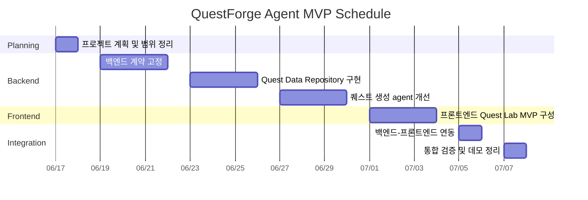

# QuestForge Agent 간트차트용 일정

기준일: 2026-06-17  
종료일: 2026-07-08  
목표: 백엔드 agent 계약 안정화부터 프론트엔드 Quest Lab MVP까지 짧게 완성한다.

## 간트 입력용 항목

| ID | 작업 항목 | 시작일 | 종료일 | 기간 | 선행 작업 | 산출물 |
| --- | --- | --- | --- | --- | --- | --- |
| 1 | 프로젝트 계획 및 범위 정리 | 2026-06-17 | 2026-06-18 | 2일 | 없음 | README, 아키텍처/일정 문서 |
| 2 | 백엔드 계약 고정 | 2026-06-19 | 2026-06-22 | 4일 | 1 | WebSocket/HTTP 계약, 테스트 기준 정리 |
| 3 | Quest Data Repository 구현 | 2026-06-23 | 2026-06-26 | 4일 | 2 | CSV loader, repository, 관련 테스트 |
| 4 | 퀘스트 생성 agent 개선 | 2026-06-27 | 2026-06-30 | 4일 | 3 | production/delivery quest context 개선 |
| 5 | 프론트엔드 Quest Lab MVP 구성 | 2026-07-01 | 2026-07-04 | 4일 | 2 | React/Vite UI, 요청 폼, 결과 패널 |
| 6 | 백엔드-프론트엔드 연동 | 2026-07-05 | 2026-07-06 | 2일 | 4, 5 | WebSocket request/response 연결 |
| 7 | 통합 검증 및 데모 정리 | 2026-07-07 | 2026-07-08 | 2일 | 6 | smoke test, 실행 가이드, 데모 시나리오 |

## Mermaid Gantt

## 마일스톤

| 마일스톤 | 목표일 | 완료 기준 |
| --- | --- | --- |
| M1. 계획 확정 | 2026-06-18 | 범위, 기술 스택, 일정 문서화 |
| M2. 백엔드 기본 안정화 | 2026-06-22 | `/health`, manifest, WebSocket 계약 확인 |
| M3. agent 데이터 연동 | 2026-06-30 | 샘플 CSV 기반 quest context 생성 |
| M4. 프론트 MVP | 2026-07-04 | Quest Lab에서 요청 작성과 결과 표시 가능 |
| M5. 통합 데모 | 2026-07-08 | 로컬 실행, smoke test, 데모 흐름 확인 |

## 일정 메모

- 프론트엔드와 백엔드는 완전히 병렬로 두지 않고, 백엔드 계약이 고정된 뒤 프론트엔드를 시작한다.
- 2026-07-08까지의 목표는 완성형 서비스가 아니라 포트폴리오용 MVP 데모다.
- 로그인, DB 저장, 관리자 페이지, Unreal 클라이언트 코드는 이번 일정에 포함하지 않는다.
